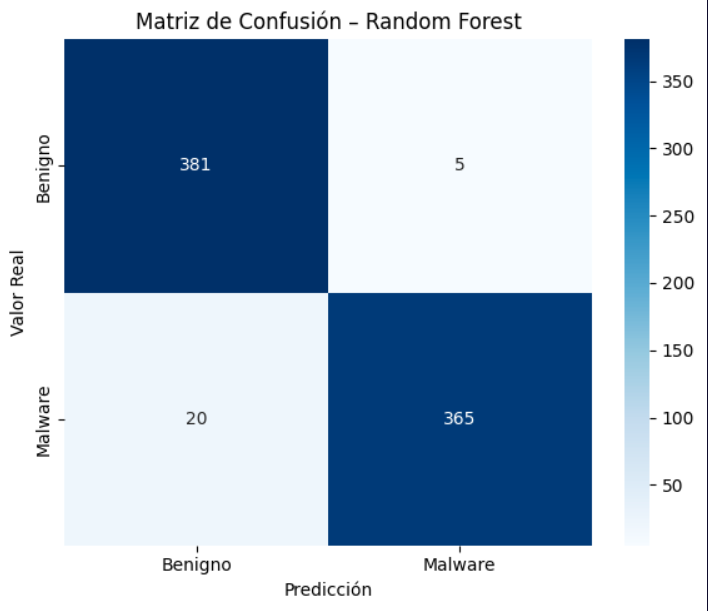
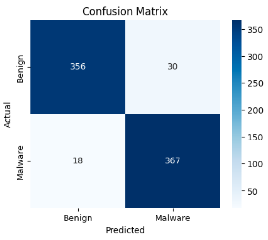

# Laboratorio 2

- Pedro Pablo Guzmán 22111
- Javier Chen 22153

Se desarrollaron 2 modelos de machine learning para detectar malware en base a la secuencia de llamadas a las API, en el [primero](./Lab02_modelo1.ipynb) la secuencia de llamadas se transformó a bigramas y luego se aplicó la técnica de TF-idf. Se uso el output generado para entrenar un modelo de random forest el cuál tuvo las siguientes métricas con el conjunto de pruebas:

| Métrica   | Valor  |
| --------- | ------ |
| Accuracy  | 0.9676 |
| Precision | 0.9865 |
| Recall    | 0.9481 |

Vemos que el modelo fue bastante eficaz.

Luego, se realizó otro [modelo](./gemini.ipynb) el cuál juntó toda la secuencia de llamadas de cada archivo en un mismo string y con la API de Gemini de Google se generarón embeddings de más de 3,000 features para cada una. Con esto, se entrenó una red neuronal con estos hiperparámetros:

- Función de pérdida: Entropía Cruzada Binaria (BSELOSS)
- Learning rate de 0.001
- Una capa de 256 neuronas con una función de activación ReLu
- Otra capa de 128 neuronas con función de activación ReLu
- Finalmente se aplicó una función sigmoide para la salida final

Este modelo dio estas métricas de rendimiento:

| Métrica   | Valor  |
| --------- | ------ |
| Accuracy  | 0.9377 |
| Precision | 0.9244 |
| Recall    | 0.9532 |

## Comparación de modelos

| Métrica   | TF-IDF + RF | Gemini + MLP |
| --------- | ----------- | ------------ |
| Accuracy  | **0.9676**  | 0.9377       |
| Precision | **0.9865**  | 0.9244       |
| Recall    | 0.9481      | **0.9532**   |

En base a estos resultados podemos observar que ambos se desempeñan bastante bien y ninguno tiene overfitting pues ambos tuvieron este gran rendimiento con el conjunto de pruebas. El modelo de random forest identifica de forma más balanceada ambas clases pues a diferencia de la red neuronal, este detecta muy pocas veces archivos benignos como malware por lo que en un ambiente de producción este daría muy pocas falsas alarmas y además de eso detecta una cantidad de malware como benignos bastante similar al modelo con embeddings. Si bien la red neuronal es un poco mejor detectando malware ya que tiene un mejor recall y detectó menos archivos de malware como benignos, la diferencia no es significativa con el random forest y aparte de eso este modelo de una cantidad de falsas alarmas que es 6 veces mayor a la de el primer modelo por lo que en producción la tasa de falsas alarmas sería mayor. 

En conclusión, ambos modelos son bastante funcionales pero el random forest se desempeñaría mejor en un ambiente de producción por su baja cantidad de falsas alarmas lo cuál reduciría la carga operativa de revisar e investigar esta clase de alarmas. 

